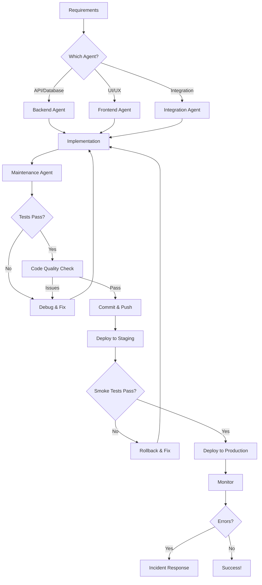

# VocalScale AI Agent System

## Overview

This directory contains four specialized AI agents that work together to develop, maintain, and deploy the VocalScale application. Each agent has specific expertise and responsibilities, working in harmony to ensure code quality, functionality, and reliability.

---

## 🤖 The Four Agents

### 1. [Backend Agent](./01-backend-agent.md) 🔧
**Expertise:** Go services, APIs, database, server-side logic

**Responsibilities:**
- Build and maintain REST APIs
- Database operations and migrations
- External API integrations (Deepgram, Twilio, Stripe)
- Background jobs and cron tasks
- Server-side business logic

**Use For:**
- Creating new API endpoints
- Database schema changes
- Fixing backend bugs
- Optimizing server performance
- Implementing new backend features

---

### 2. [Frontend Agent](./02-frontend-agent.md) 🎨
**Expertise:** React, TypeScript, UI/UX, client-side development

**Responsibilities:**
- Build user interfaces and components
- State management with Context API
- Connect to backend APIs
- Responsive design and accessibility
- User experience optimization

**Use For:**
- Creating new pages and components
- Improving UI/UX design
- Fixing frontend bugs
- Adding new features to dashboard
- Mobile responsiveness

---

### 3. [Integration Agent](./03-integration-agent.md) 🔌
**Expertise:** Third-party APIs, deployment, infrastructure

**Responsibilities:**
- External API integration (Deepgram, Twilio, Stripe, Google)
- Docker and deployment configuration
- Nginx and load balancing
- Monitoring and logging
- Security and compliance

**Use For:**
- Adding new integrations
- Deployment configuration
- Debugging WebSocket issues
- Setting up monitoring
- Infrastructure optimization

---

### 4. [Maintenance & QA Agent](./04-maintenance-qa-agent.md) ✅
**Expertise:** Testing, CI/CD, git operations, code quality

**Responsibilities:**
- Run automated tests
- Manage git workflow (check, test, commit, push)
- Code quality assurance
- Maintain full backend knowledge
- Deployment validation
- Performance analysis

**Use For:**
- Running tests before deployment
- Code quality checks
- Git operations and commits
- Analyzing backend architecture
- Pre-deployment validation
- Performance profiling

---

## 🚀 How to Use These Agents

### Workflow 1: Adding a New Feature

**Example: Add SMS notification feature**

1. **Backend Agent** - Create API endpoint
   ```
   - Add SMS notification API endpoint
   - Store notification preferences in database
   - Integrate with Twilio SMS API
   ```

2. **Frontend Agent** - Build UI
   ```
   - Add notification settings page
   - Create SMS preference toggle
   - Show notification history
   ```

3. **Integration Agent** - Connect services
   ```
   - Configure Twilio SMS integration
   - Set up webhook handlers
   - Add monitoring for SMS delivery
   ```

4. **Maintenance Agent** - Validate and deploy
   ```
   - Run all tests
   - Check code quality
   - Commit: "feat(notifications): add SMS notification system"
   - Push to staging
   - Validate deployment
   ```

---

### Workflow 2: Fixing a Bug

**Example: Voice agent not responding in Spanish**

1. **Maintenance Agent** - Analyze issue
   ```
   - Check logs for errors
   - Identify root cause in backend
   - Create test case to reproduce
   ```

2. **Backend Agent** - Fix the bug
   ```
   - Update Deepgram language configuration
   - Fix greeting language logic
   - Add language fallback
   ```

3. **Frontend Agent** - Update UI if needed
   ```
   - Add language selector if missing
   - Show language status clearly
   ```

4. **Maintenance Agent** - Test and deploy
   ```
   - Run tests
   - Verify fix works
   - Commit: "fix(agent): correct Spanish language support"
   - Deploy with monitoring
   ```

---

### Workflow 3: Daily Development Cycle

**Morning:**
```bash
# Maintenance Agent: Sync and analyze
git pull origin main
# Review overnight changes
# Check for any failing tests
```

**During Development:**
```bash
# Backend/Frontend/Integration Agents: Build features
# Each agent focuses on their specialty
# Collaborate on cross-cutting features
```

**Before Lunch:**
```bash
# Maintenance Agent: Quality check
go test ./...
golangci-lint run
# Commit morning's work
```

**Afternoon:**
```bash
# Continue development
# Integration testing
```

**End of Day:**
```bash
# Maintenance Agent: Final checks
go test ./...
git add .
git commit -m "feat: description of day's work"
git push origin main
# Verify CI/CD pipeline passes
```

---

## 🎯 Agent Collaboration Patterns

### Pattern 1: New API Endpoint

| Agent | Task |
|-------|------|
| Backend | Create handler, business logic, database queries |
| Frontend | Create API service call, UI components |
| Maintenance | Write tests, validate responses |
| Integration | Add monitoring, check logs |

### Pattern 2: External Integration

| Agent | Task |
|-------|------|
| Integration | Research API, implement client |
| Backend | Create webhook handlers, store tokens |
| Frontend | Build connection UI, show status |
| Maintenance | Test OAuth flow, monitor errors |

### Pattern 3: Performance Optimization

| Agent | Task |
|-------|------|
| Maintenance | Profile app, identify bottlenecks |
| Backend | Optimize queries, add caching |
| Frontend | Lazy load components, optimize renders |
| Integration | CDN setup, database tuning |

---

## 📋 Quick Reference

### When to Use Each Agent

**Backend Agent** when you need to:
- ✅ Create or modify API endpoints
- ✅ Change database schema
- ✅ Fix server-side bugs
- ✅ Implement business logic
- ✅ Work with backend integrations

**Frontend Agent** when you need to:
- ✅ Build or update UI components
- ✅ Improve user experience
- ✅ Fix frontend bugs
- ✅ Add new pages
- ✅ Style and design work

**Integration Agent** when you need to:
- ✅ Add third-party services
- ✅ Configure deployment
- ✅ Set up monitoring
- ✅ Debug WebSocket issues
- ✅ Infrastructure work

**Maintenance Agent** when you need to:
- ✅ Run tests before pushing
- ✅ Check code quality
- ✅ Analyze backend architecture
- ✅ Deploy to production
- ✅ Investigate performance issues

---

## 🔄 Complete Development Lifecycle



---

## 📁 VocalScale Project Structure

```
vocalscale/
├── .agents/                     # 👈 You are here
│   ├── README.md               # This file
│   ├── 01-backend-agent.md     # Backend rules
│   ├── 02-frontend-agent.md    # Frontend rules
│   ├── 03-integration-agent.md # Integration rules
│   └── 04-maintenance-qa-agent.md # QA rules
├── vocalscale-V1/
│   └── frontend/               # React TypeScript app
│       ├── src/
│       ├── public/
│       └── package.json
└── vocalscale-V1-main/
    └── backend/                # Go services
        ├── services/
        ├── deploy/
        └── migrations/
```

---

## 🎓 Best Practices

### 1. Agent Coordination
- Agents should communicate about changes affecting multiple areas
- Backend agent defines API contract before frontend builds UI
- Integration agent validates external APIs before backend implementation
- Maintenance agent validates everything before deployment

### 2. Code Quality
- All agents must follow TypeScript/Go best practices
- Security is everyone's responsibility
- Performance considerations at every layer
- Accessibility and UX in all frontend work

### 3. Testing
- Backend agent writes unit tests for business logic
- Frontend agent tests components and user flows
- Integration agent tests external API connections
- Maintenance agent runs full test suite before deployment

### 4. Documentation
- Update relevant agent docs when patterns change
- Keep README files current
- Document complex logic inline
- Maintain API documentation

---

## 🚨 Emergency Procedures

### Production Down
1. **Maintenance Agent** - Immediately rollback to last known good version
2. **All Agents** - Investigate logs and identify root cause
3. **Responsible Agent** - Implement hotfix
4. **Maintenance Agent** - Fast-track testing and deployment
5. **All Agents** - Post-mortem and prevention plan

### Security Incident
1. **Integration Agent** - Rotate compromised credentials immediately
2. **All Agents** - Audit code for security issues
3. **Backend Agent** - Patch vulnerabilities
4. **Maintenance Agent** - Deploy security patches ASAP
5. **All Agents** - Document incident and improvements

### Data Loss Risk
1. **Maintenance Agent** - Immediate database backup
2. **Backend Agent** - Halt destructive operations
3. **All Agents** - Assess impact and recovery plan
4. **Maintenance Agent** - Execute recovery procedure
5. **All Agents** - Implement safeguards to prevent recurrence

---

## 📚 Additional Resources

- [Backend Agent Deep Dive](./01-backend-agent.md)
- [Frontend Agent Deep Dive](./02-frontend-agent.md)
- [Integration Agent Deep Dive](./03-integration-agent.md)
- [Maintenance & QA Deep Dive](./04-maintenance-qa-agent.md)

---

## 🎯 Success Metrics

Your agent system is working well when:

- ✅ Features ship faster with fewer bugs
- ✅ Code quality improves over time
- ✅ Deployments are smooth and predictable
- ✅ Tests catch issues before production
- ✅ Team colaboration is seamless
- ✅ Technical debt decreases
- ✅ User satisfaction increases

---

## 📝 Notes

- Each agent has full context of their domain
- Agents work autonomously but collaborate when needed
- Quality and security are never compromised
- Continuous improvement is the goal

---

**Created:** January 2026  
**Version:** 1.0  
**Maintained by:** VocalScale Development Team
